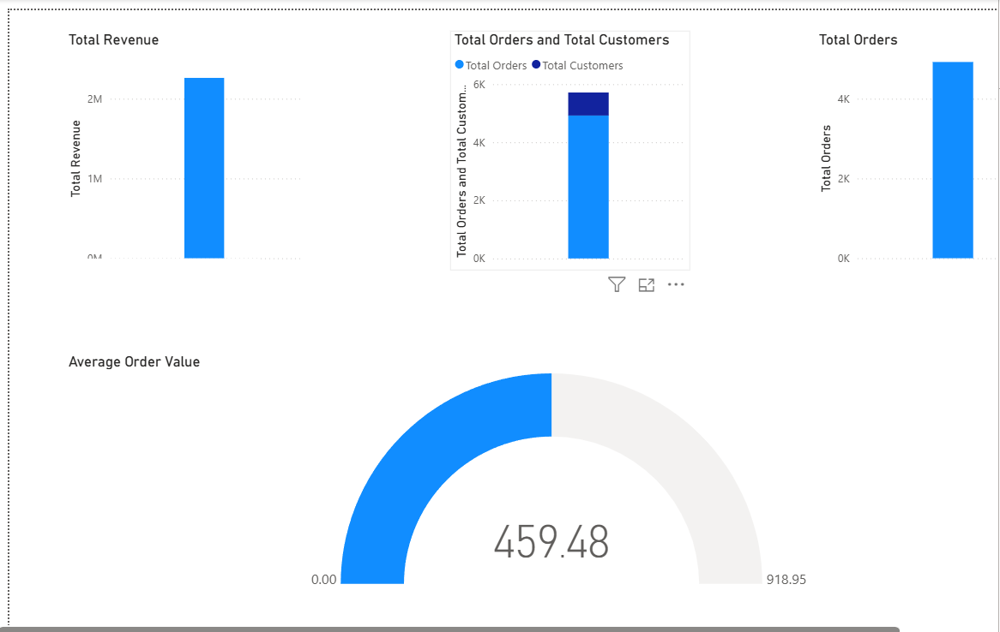
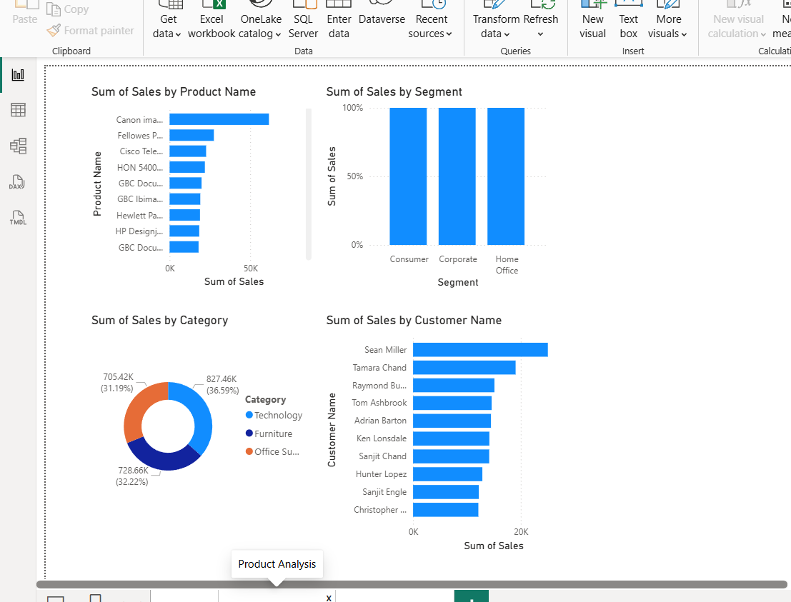
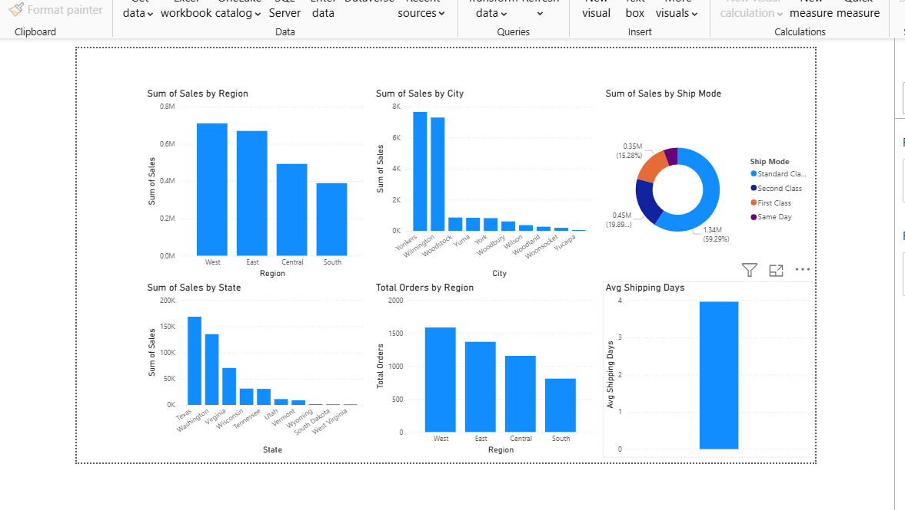

# InsightFlow – End-to-End Sales Analytics Dashboard

## Overview

InsightFlow is an end-to-end sales analytics project built using PostgreSQL, Python (Pandas), SQL, and Power BI. The project demonstrates a complete data analytics workflow, including data cleaning, database management, SQL analysis, and interactive dashboard development.

The goal of the project is to transform raw sales data into meaningful business insights that support decision-making.

---

## Problem Statement

Organizations generate large amounts of sales data but often struggle to extract actionable insights from it.

This project aims to:

* Clean and prepare raw sales data.
* Store structured data in PostgreSQL.
* Perform analytical queries using SQL.
* Build interactive Power BI dashboards.
* Identify trends related to products, customers, regions, and shipping operations.

---

## Tech Stack

### Database

* PostgreSQL

### Programming Language

* Python

### Libraries

* Pandas
* SQLAlchemy
* psycopg2

### Visualization

* Power BI

### Version Control

* Git & GitHub

---

## Dataset Information

The dataset contains sales transaction records with attributes such as:

* Order ID
* Order Date
* Customer ID
* Customer Name
* Product Name
* Category
* Sub-Category
* Region
* State
* City
* Ship Mode
* Sales

Total Records: 9,800+

---

## Project Workflow

### 1. Data Collection

Raw sales data was collected in CSV format.

### 2. Data Cleaning

Using Pandas, the following preprocessing steps were performed:

* Removed duplicate records
* Handled missing values
* Standardized column names
* Converted date fields to proper formats
* Validated numerical fields

### 3. Data Loading

The cleaned dataset was loaded into PostgreSQL using SQLAlchemy.

### 4. Data Analysis

SQL queries were used to analyze:

* Revenue trends
* Product performance
* Customer behavior
* Regional sales performance
* Shipping patterns

### 5. Dashboard Development

Interactive dashboards were created in Power BI for business reporting and visualization.

---

## Dashboard Pages

### 1. Executive Overview

KPIs:

* Total Revenue
* Total Orders
* Total Customers
* Average Order Value

Visuals:

* Revenue Summary
* Order Analysis
* Customer Analysis

## Dashboard Screenshots

### Executive Overview

---

### 2. Product & Customer Analysis

Key Insights:

* Top Selling Products
* Category-wise Sales Distribution
* Customer Segment Analysis
* Top Customers by Revenue

Visuals:

* Product Revenue Charts
* Category Distribution
* Segment Analysis
* Customer Performance Dashboard

### Product & Customer Analysis

---

### 3. Regional & Shipping Analysis

Key Insights:

* Sales by Region
* Sales by State
* Top Performing Cities
* Shipping Mode Analysis
* Average Shipping Days

Visuals:

* Regional Revenue Charts
* State-Level Analysis
* Shipping Performance Dashboard

### Regional & Shipping Analysis

---

## Key Business Insights

* The West region generated the highest sales revenue.
* Technology products contributed the largest share of sales.
* Consumer segment customers accounted for the majority of revenue.
* Standard Class was the most commonly used shipping mode.
* A small group of customers contributed significantly to overall sales.

---

## Project Structure

InsightFlow/

├── data/

├── scripts/

│ ├── clean_data.py

│ └── load_data.py

├── sql/

│ └── analysis_query.sql

├── dashboard/

│ └── InsightFlow Dashboard.pbix

├── screenshot/

│ ├── executive_overview.png

│ ├── product_analysis.png

│ └── regional_analysis.png

└── README.md
---